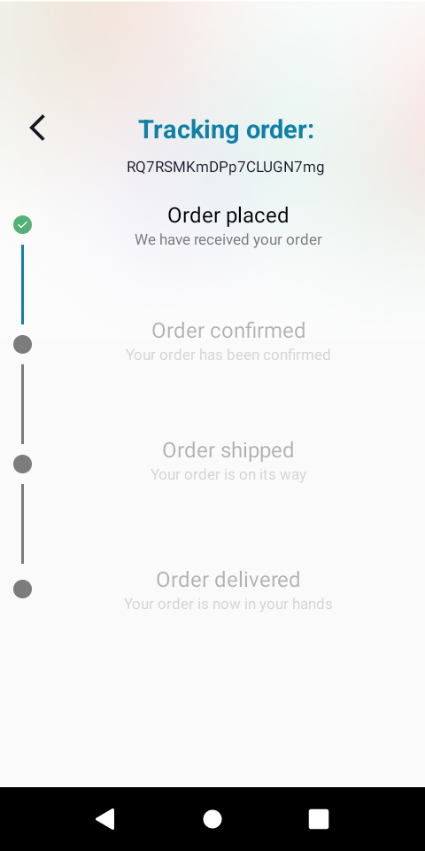

# Eshop
E-commerce android application that makes user buy his food easily.

## Requirements
- Writen in Kotlin
- Uses firebase firestore for online database 
- Uses firebase authentication with gmail
- Ability to search product by name
- See the products by category
- Show products with detail description and contents of calories, fat, carbs protein
- Select favourite products and share them in social
- See all your favourite products
- Button to place products in cart
- Place an order from the cart
- Pay and track your order
- See your order history
- Keep personal account with image, email and delivery location
- Ability to edit personal information

## Tools used
- Room
- Dagger Hilt
- Retrofit 
- Glide 
- Google Maps SDK 
- Stripe Payment SDK 
- Firebase 

# Screenshots

